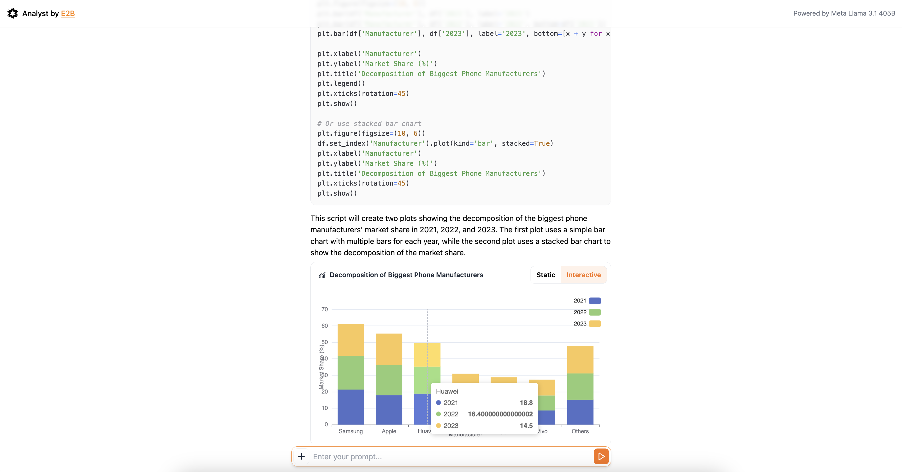

# AI Analyst by E2B
This is an AI-powered code and data analysis tool built with Next.js and the E2B SDK.



→ Try on [analyst.e2b.dev](https://e2b-analyst.vercel.app/)

## Features
- 🔸 Analyze data with Meta's Llama 3.1
- 🔸 Upload CSV files
- 🔸 Create interactive charts

Powered by:
- 🔸 ✶ [E2B Sandbox](https://github.com/e2b-dev/code-interpreter)
- 🔸 Vercel's AI SDK
- 🔸 Next.js

Supported LLM Providers:
- 🔸 TogetherAI
- 🔸 Fireworks

**Make sure to give us a star!**


## Get started

Visit the [online version](https://ai-analyst.e2b.dev/) or run locally on your own.

### 1. Clone repository
```
git clone https://github.com/e2b-dev/ai-analyst.git
```

### 2. Install dependencies
```
cd fragments && npm i
```

### 3. Get API keys
Set the environment variables in the `.env.local` file. Get your [E2B API key here](https://e2b.dev/dashboard?tab=keys).
```
E2B_API_KEY=
FIREWORKS_API_KEY=
TOGETHER_AI_API_KEY=
```
